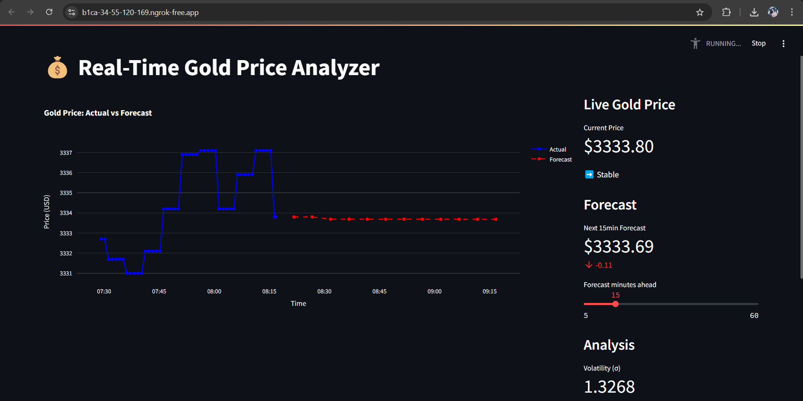
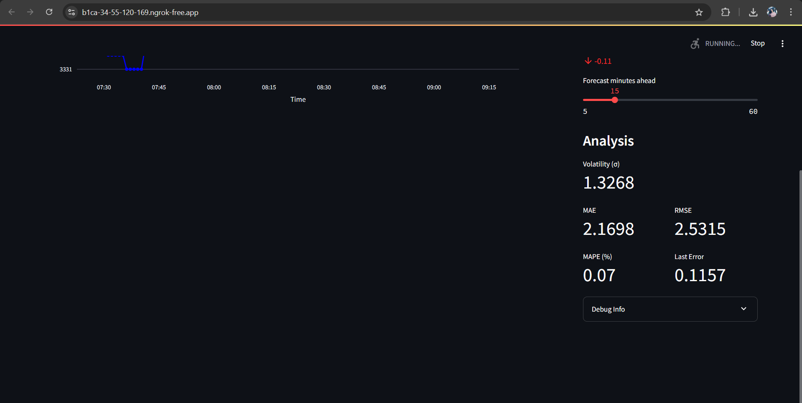

# 💰 Real-Time Gold Price Forecasting Dashboard

**Author:** Eshal Shanoj  
**Date:** April 2025  

---

## 🚀 Overview

This project is a real-time, interactive Streamlit dashboard for gold price tracking, analysis, and forecasting.  
It fetches live gold price data from **Yahoo Finance**, visualizes trends, and predicts future prices using **ARIMA** and optionally **Hybrid ARIMA-LSTM** models.

The dashboard displays:
- Live prices
- Forecasts (customizable time horizon)
- Volatility and forecasting metrics (MAE, RMSE, MAPE, Last Error)

Designed for big data coursework, it showcases real-time ingestion, time series forecasting, and interactive analytics—all in your browser.




---

## 🛠️ Tech Stack

- Python 3.x  
- [Streamlit](https://streamlit.io) – Dashboard UI  
- [yfinance](https://pypi.org/project/yfinance/) – Live gold price data (GC=F)  
- [statsmodels](https://www.statsmodels.org/) – ARIMA forecasting  
- [Keras + LSTM](https://keras.io) – Optional residual modeling  
- [Plotly](https://plotly.com/python/) – Interactive visualizations  
- `numpy`, `pandas` – Data manipulation  
- [pyngrok](https://github.com/inconshreveable/ngrok) – Public URL for dashboard  
- `python-dotenv` – Secure token management  

---

## 📈 Features

- Real-time gold price updates (1-min intervals)
- Forecasts (ARIMA or Hybrid ARIMA+LSTM)
- Error metrics: MAE, RMSE, MAPE, Last Error
- Volatility tracking
- Custom forecast window: 5–60 minutes ahead
- Debugging + API response testing in sidebar
- Secrets managed via `.env`
- Colab-compatible

---

## 📦 Installation

### 🔁 Clone the Repo
```bash
git clone https://github.com/eshxl/realtime-gold-price-forecasting.git
cd realtime-gold-price-forecasting
